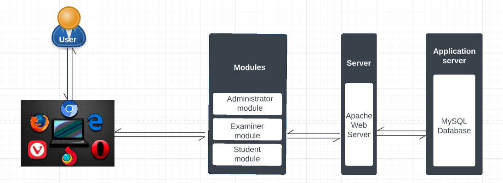

# Computer Based Testing System :page_facing_up:

This project Exam portal was completed using PHP script with Mysql Database. Other techologies used are;
* HTML
* CSS
* Javascript
* Bootstrap
* Ajax

## Architecture :couple:

## Features :speech_balloon:
* **General Features**
    - Cross-platform
    - Responsive
    - Accessible
    - Supports objective questions

### User-specific features
* **Student**
    - Resumption capability for students
    - Automatic grading
    - Question randomization

* **Examiner**
    - Manage exams and set questions for assigned courses.
    - Activate exams.
    - Set exam time and instruction.
    - View all exam results of exams for assigned courses.

* **Administrator**
    - Register users and courses.
    - View users and courses.

## Demo :running:

## Authors :black_nib:

* Owen Owade <[Owendrinkwater](https://github.com/Owendrinkwater)>
